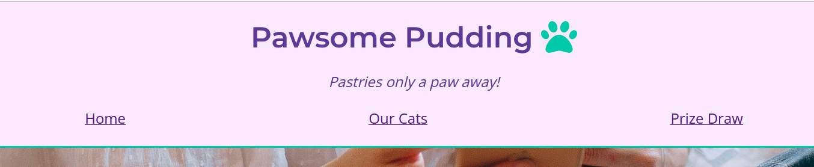
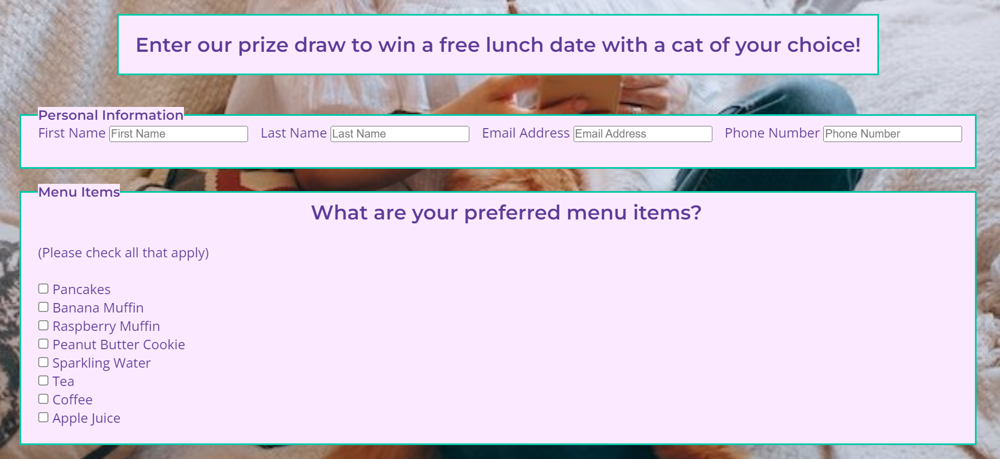
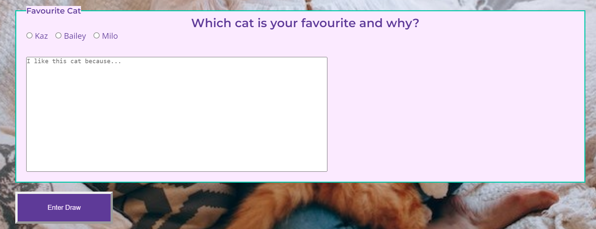
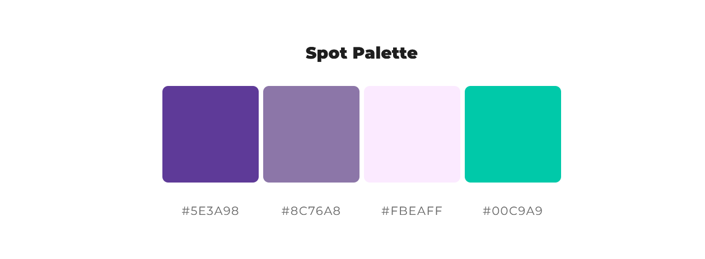
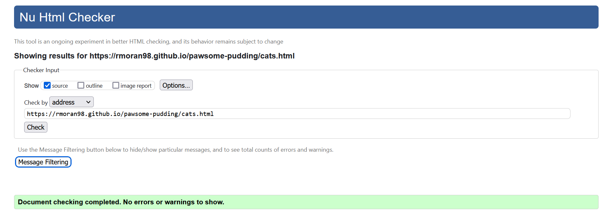
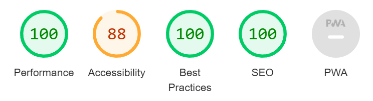

# Pawsome Pudding
Pawsome Pudding is a website for a cat cafe. Visitors to the site can view the menu, read about the resident cats, enter into a prize draw, and find the contact information and address of the cafe. The website is aimed at cat lovers. The website can be found [here](https://rmoran98.github.io/pawsome-pudding/).

## Features
### Existing Features
#### Header and Footer
- Header
  - The Header includes the website name, tagline, logo and navigation bar, and is the same on all pages of the website.
  - The navigation bar contains links to the Home, Our Cats, and Prize Draw pages. This will allow the user to easily move between pages. The links change background color and font color on hovering the mouse over them so the user can easily see they are over a link. Aria labels are used to add accesibility for screen readers.
  

- The footer section features links to social media sites, displayed as Font Awesome icons. The footer is the same across all pages. On hovering the mouse over them, the link icons gain a background color to show the user they are mousing over a link. Aria labels are also used here to add accessibility to screen readers.


#### Home
- The Why We Love Cats section has a brief description of the cafe and why its owners decided to open a cat cafe.


- The Food and Drink Menus allow the user to see allergen information and determine if Pawsome Pudding will cater to their dietary needs.


- The Contact section features the telephone, email address, and the physical address of the cafe.


- A map image shows the user where the cafe is located.


#### Our Cats
- The Our Cats page features three short bios of the cafe's resident cats, including a photo of each cat.


#### Prize Draw
- The Prize Draw page features a form with various inputs, allowing the user to submit their details for the chance to win a prize. It also includes a brief description of the prize.


- The submit button for the form redirects the user to a Thank You page with a short message thanking them for filling out the form, and assuring them that they will be contacted soon. The button changes appearance on hovering the mouse over it, and the cursor is displayed as a pointer, so the user can easily tell they are about to click it.


#### Thank You
- The thank you page is only accessible by clicking the submit button, and should otherwise be invisible to site visitors. After 10 seconds, it will redirect the user back to the Home page.


### Features Left to Implement
- The navigation bar was intended to be sticky, remaining at the top of the page when the user scrolls down, while the rest of the header remains in place. At present this is beyond my capabilities, but can be added in the future.
- The map was intended to be displayed as an iframe of Google Maps so that the user could interact with it, but I was unfamiliar with the API requirements. Curently, I have removed the iframe element and inserted a screenshot of Google Maps as a replacement, but ideally I would revisit this in future and reimplement the iframe.
- A custom 404 page.

## Design
### User Stories
- As a vegetarian/vegan, I want to see the menu displayed on the website, so that I know if this cafe will cater to my needs.
- As a new customer, I want to see an address, and a map, so that I can easily find the cafe.
- As a regular customer, I want to see special offers, so that I can be rewarded for my patronage.
- As a cat lover, I want to see information about the cafe’s cats, so that I know they are well looked after.
- As someone planning a party, I want to see contact information, so I can arrange a booking here.
- As a visually impaired person, I want links to have text for my screen reader, so that the website is accessible for me.
- As a smartphone user, I want the website to adapt to the size of my screen, so that it remains readable for me.

### Color Scheme
As a cat cafe is a place a customer might go to relax, I wanted a color palette on the cool side of the spectrum, since these colors are more relaxing. I chose a dark purple to begin with, then generated a color palette from there. 


Then I tested my color palette to ensure the colors would be readable and have good contrast once implemented. My results showed that a font color of `#5e3a98` and a background color of `#fbeaff` was the most readable combination. I decided to use the color `#00c9a9` as a border color, to add some interest.


### Fonts
For accessibility purposes, I wanted an easy to read font. I researched the fonts available from Google Fonts and decided to use the Open Sans font for main text, combined with Montserrat for the headings.

### Wireframes
#### Desktop
- [Home](documentation/desk-home.png)
- [Our Cats](documentation/desk-cats.png)
- [Prize Draw](documentation/desk-form.png)
- [Thanks](documentation/desk-thanks.png)

#### Mobile and Tablet
- [Home](documentation/mobile-home.png)
- [Our Cats](documentation/mobile-cats.png)
- [Prize Draw](documentation/mobile-form.png)
- [Thanks](documentation/mobile-thanks.png)

## Bugs
### Resolved Bugs
- Incorrect syntax in the [style.css](assets/css/style.css) file prevented CSS styling showing in the deployed webpage. Changing 
```
body {
    background-color: aqua;
    color: crimson;
}
``` 
to 
```
p {
    background-color: aqua;
    color: crimson;
}
```
resolved the issue.
- An unneccessary space in the markdown for the inline links in the Credits section of this README was causing both the display text and the full url to show.
- A syntax issue was causing the checkbox list in the Menu Items section of the [Prize Draw](giveaway.html) form to display as a text input. Changing it from a datalist to checkbox tags resolved the issue.
- Submit button was not properly redirecting to the [thanks](thanks.html) page. 
Changing
```
<a href="thanks.html">
  <input type=submit value="Enter Draw">
</a>
```
to
`<button type="submit">Enter Draw</button>`
and adding
`method="get" action="thanks.html"`
to the opening form tag resolved the issue.
- A missing .jpg file extension was preventing the image for [Milo](assets/images/milo.png) from showing in the [Our Cats](cats.html) page.
- The background image was not displaying as intended. Moving the background image css from the main tag into the body tag styling, changing the background-color value to transparent for the columns class and using a relative file path for the image resolved the issue.
- On the index.html page, the font awesome icon "fa-solid fa-envelopes-bulk fa-2xl" was duplicating itself. When using the inspect feature in-browser, the code displayed extra
`<i class="fa-solid fa-envelopes-bulk fa-2xl">` between sections, which was not present in the code pushed to GitHub. This was also causing visual distortion of the map and footer elements. I resolved the issue by removing the original icon which was duplicating.
- A missing `padding: 0; box-sizing: border-box;` under the global CSS styling was causing the website to overflow past the viewport and display a horizontal scroll bar.

### Unfixed Bugs
- Google Maps iframe refuses to display in Firefox, Google Chrome and Microsoft Edge browsers. Other browsers untested.

## Testing
### Validator Testing
#### HTML Validator
- The Home page shows no warnings or errors


- The Our Cats page shows no warnings or errors


- The Prize Draw page shows no warnings or errors


- The Thanks page shows no warnings or errors


#### CSS Validator
- The CSS stylesheet shows no warnings or errors


#### Lighthouse testing
- Lighthouse results for the Home page:


- Lighthouse results for the Our Cats page:


- Lighthouse results for the Prize Draw page:


- Lighthouse results for the Thanks page:


### Manual Testing
- The navigation bar and footer links have been tested and lead to the correct webpage.
- The form elements on the Prize Draw page behave as expected.
- The submit button redirects the user to the Thanks page.
- The Thanks page will redirect the user back to the Home page.
- Images display as expected.
- The background and font color of the links change on hover.
- The button changes background color, font color, and border style on hover.

### Responsiveness
- The viewing experience on different screens has been tested and is as follows:


## Deployment
To deploy this website, first clone it under the code dropdown menu at the [GitHub Respository](https://github.com/RMoran98/pawsome-pudding). Next, navigate to settings > pages in the cloned GitHub repository. Under Build and Deployment > Branch, select main for the branch and save.  

The live link for the website can be found [here](https://rmoran98.github.io/pawsome-pudding/).

### Local Deployment
Copy and paste the following into your IDE: `https://github.com/RMoran98/pawsome-pudding.git` followed by the `git clone` command and hit enter. Once your IDE has finished cloning the repository, next type `cd pawsome-pudding/` and hit enter. Then type `clone .` and hit enter a final time.

## Credits
### Content
- The README was created and formatted based on Code Institute's [Sample README](https://learn.codeinstitute.net/courses/course-v1:CodeInstitute+CSSE_PAGPPF+2021_Q2/courseware/66cf361c769a41d496f5001fae6f9be7/3b5cd5dc8313462aa5975a3c9b9a1a3c/), [README Template](https://github.com/Code-Institute-Solutions/readme-template) and [Iullia Konovalova's Animal Shelter README](https://github.com/IuliiaKonovalova/animal_shelter/tree/main)
- The [Github tutorial](https://docs.github.com/en/get-started/writing-on-github/getting-started-with-writing-and-formatting-on-github/basic-writing-and-formatting-syntax) was used to learn the markdown syntax for the README
- This [HTML tutorial](https://html5-tutorial.net/forms/checkboxes/) was used to fix an issue with the checkboxes in the form on the [Prize Draw(giveaway.html)] page
- The fonts used were obtained from [Google Fonts](https://fonts.google.com/)
- For the flexbox CSS, I followed two tutorials; [CSS Tricks](https://css-tricks.com/snippets/css/a-guide-to-flexbox/) and [Kevin Powell](https://www.youtube.com/watch?v=u044iM9xsWU)
- This [Yale University tutorial](https://usability.yale.edu/web-accessibility/articles/links) was used to add text for screen readers to the header and footer links.

### Tools and Technologies
- This website is coded using [HTML](https://developer.mozilla.org/en-US/docs/Web/HTML) and [CSS](https://developer.mozilla.org/en-US/docs/Web/CSS)
- All code was written and edited in [VSCode](https://code.visualstudio.com/)
- Version control was handled using [Git](https://git-scm.com/)
- [GitHUB](https://github.com/) and [GitHUB Desktop](https://desktop.github.com/) were used to host the code repository
- The color palette was generated using [ColorSpace](https://mycolor.space/)
- [WebAIM](https://webaim.org/resources/contrastchecker/) was used to test the contrast and readability of the color palette
- The Wireframes were created using [balsamiq](https://balsamiq.com/)
- The code repository was created from this [Code Institute template](https://github.com/Code-Institute-Org/ci-full-template)
- Photos were edited using [Microsoft Windows 10's inbuilt Photos app](https://www.microsoft.com/en-gb/software-download/windows10)
- The code to redirect the user from thanks.html back to index.html was provided by [Iullia Konovalova](https://github.com/IuliiaKonovalova)
- HTML was validated using the [W3C HTML validator](https://validator.w3.org/)
- CSS was validated using the [W3C CSS validator](https://jigsaw.w3.org/css-validator/)
- I used [Google Lighthouse](https://developer.chrome.com/docs/lighthouse/overview/) to test the performance and accessibility of my website
- To test how the website looks on different screens I used [Chrome Devtools](https://developer.chrome.com/docs/devtools/) and the [Responsive Viewer extension](https://chrome.google.com/webstore/detail/responsive-viewer/inmopeiepgfljkpkidclfgbgbmfcennb)

### Media
[Font Awesome](https://fontawesome.com/) icons have been used on all html pages.

The image for the map in index.html is a screenshot of the Google Maps display of [The Seafood bar at Kirwan's](https://www.google.com/maps/place/The+Seafood+Bar+at+Kirwan's/@53.2713828,-9.0548901,19z/data=!4m6!3m5!1s0x485b96e594d6a7bb:0xc070c1f7418154b2!8m2!3d53.2713828!4d-9.0543641!16s%2Fg%2F1v1tmhd2?entry=ttu).

The following images were taken from [Pexels](https://www.pexels.com/)
- ["Milo"](https://www.pexels.com/photo/selective-focus-photography-of-orange-tabby-cat-1170986/)
- ["Bailey"](https://www.pexels.com/photo/black-and-white-cat-with-tongue-out-1317844/)
- ["Kaz"](https://www.pexels.com/photo/black-cat-1931369/)
- [Background Image](https://www.pexels.com/photo/woman-with-smartphone-stroking-cat-on-sofa-6957655/)